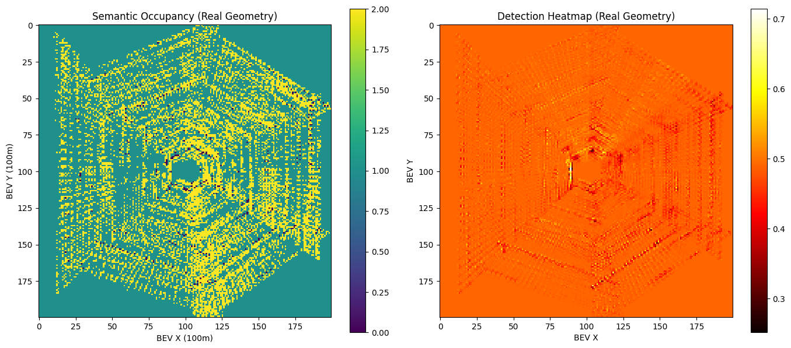
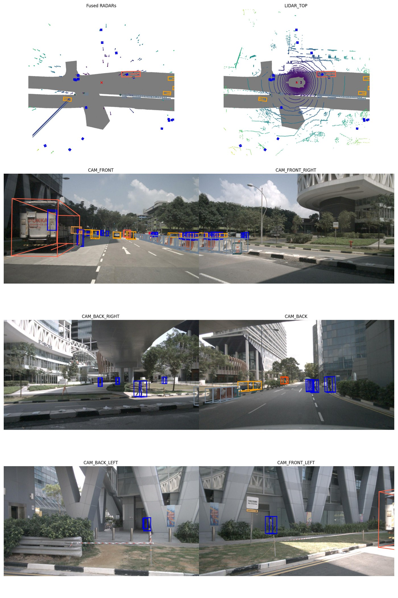
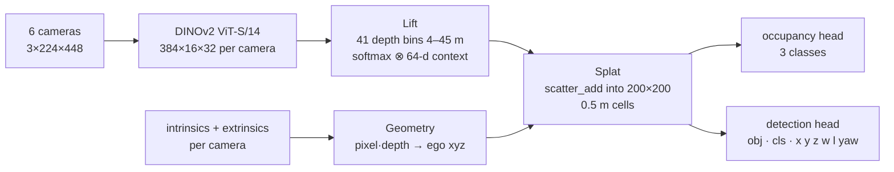

# Multi-Camera BEV Perception: Lift-Splat with a DINOv2 Backbone

A camera-only bird's-eye-view (BEV) network for autonomous driving, built module by module in PyTorch on nuScenes. It follows the **Lift-Splat-Shoot** design and replaces the image encoder with a **DINOv2 ViT-S/14** foundation model.

> **Status.** The architecture and camera geometry are complete and verified on real nuScenes calibration. The network has **not been trained yet**, so the BEV maps below show the geometry, not learned perception. The roadmap is at the end.

<p align="center">
  
  
</p>
<p align="center"><sub>Left: forward pass with the real calibration of the six cameras. The occupied area forms a hexagon of camera frustums, with a hole inside the 4 m minimum depth and empty corners beyond the 45 m maximum. Right: the nuScenes ground truth the model will learn to predict.</sub></p>

## Architecture



| Stage | Implementation | Output (batch 2) |
|---|---|---|
| Backbone | DINOv2 ViT-S/14 patch tokens reshaped to a spatial grid | `[2, 6, 384, 16, 32]` |
| Lift | 1×1 conv → depth logits (41) + context (64); outer product of softmax(depth) and context | `[2, 6, 41, 64, 16, 32]` |
| Geometry | pinhole un-projection with intrinsics rescaled to 448×224, then camera → ego with the calibrated rotation and translation | `[2, 6, 41, 16, 32, 3]` |
| Splat | sum-pooling of 125,952 frustum points (6 × 41 × 16 × 32) per sample into a 100 m × 100 m grid via a single `scatter_add_` | `[2, 64, 200, 200]` |
| Heads | conv heads for semantic occupancy and a dense detection heatmap | `[2, 3, 200, 200]` · `[2, 8, 200, 200]` |

Everything is in **[bev_perception.ipynb](bev_perception.ipynb)**, which contains the original outputs of each module's shape test and the end-to-end run.

## Roadmap

1. Rasterise nuScenes drivable area, lane polygons and 3-D box centres into 200×200 BEV targets.
2. Train with cross-entropy (occupancy) and focal + L1 (detection). Keep DINOv2 frozen, then unfreeze the last blocks.
3. Vectorise the splat over the batch and cache the rig geometry.
4. Report BEV IoU and nuScenes mAP / NDS on v1.0-trainval.

## Quick start

```bash
pip install -r requirements.txt
# nuScenes v1.0-mini (https://www.nuscenes.org/nuscenes#download) -> data/sets/nuscenes
python src/test_ingestion.py          # checks that the 6 synchronised cameras load
jupyter lab bev_perception.ipynb
```

## References & licenses

- Philion & Fidler, *Lift, Splat, Shoot: Encoding Images from Arbitrary Camera Rigs by Implicitly Unprojecting to 3D*, ECCV 2020.
- Oquab et al., *DINOv2: Learning Robust Visual Features without Supervision*, 2023.
- **nuScenes** (Caesar et al., CVPR 2020) is licensed CC BY-NC-SA 4.0 and is not redistributed here. The ground-truth render in `results/` comes from the nuScenes devkit on the mini split.
- Code: MIT (see [LICENSE](LICENSE)).
