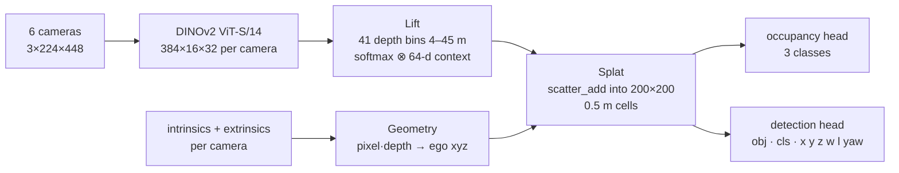

<div align="center">

# Multi-Camera BEV Perception
### Lift-Splat-Shoot with a DINOv2 Backbone

[](https://www.python.org/)
[](https://pytorch.org/)
[](LICENSE)
[](#roadmap)

A camera-only bird's-eye-view (BEV) network for autonomous driving, built module-by-module in PyTorch on nuScenes — following **Lift-Splat-Shoot**, with the image encoder replaced by a **DINOv2 ViT-S/14** foundation model.

</div>

---

## Table of Contents
- [Status](#status)
- [Results](#results)
- [Architecture](#architecture)
- [Roadmap](#roadmap)
- [Quick Start](#quick-start)
- [Project Structure](#project-structure)
- [References & Licenses](#references--licenses)

## Status

> The architecture and camera geometry are complete and verified on real nuScenes calibration. The network has **not been trained yet** — the BEV maps below show geometry, not learned perception. See the [Roadmap](#roadmap) for next steps.

## Results

<table>
<tr>
<td width="50%" valign="top">

<p align="center"><sub>Forward pass with the real calibration of 6 cameras. The occupied area forms a hexagon of camera frustums, with a hole inside the 4m minimum depth and empty corners beyond the 45m maximum.</sub></p>
</td>
<td width="50%" valign="top">

<p align="center"><sub>nuScenes ground truth the model will learn to predict.</sub></p>
</td>
</tr>
</table>

## Architecture



| Stage | Implementation | Output (batch 2) |
|---|---|---|
| Backbone | DINOv2 ViT-S/14 patch tokens reshaped to a spatial grid | `[2, 6, 384, 16, 32]` |
| Lift | 1×1 conv → depth logits (41) + context (64); outer product of softmax(depth) and context | `[2, 6, 41, 64, 16, 32]` |
| Geometry | Pinhole un-projection with intrinsics rescaled to 448×224, then camera → ego with calibrated rotation/translation | `[2, 6, 41, 16, 32, 3]` |
| Splat | Sum-pooling of 125,952 frustum points (6 × 41 × 16 × 32) per sample into a 100m × 100m grid via a single `scatter_add_` | `[2, 64, 200, 200]` |
| Heads | Conv heads for semantic occupancy and dense detection heatmap | `[2, 3, 200, 200]` · `[2, 8, 200, 200]` |

Full module-by-module shape tests and the end-to-end run live in [`bev_perception.ipynb`](bev_perception.ipynb).

## Roadmap

- [ ] Rasterize nuScenes drivable area, lane polygons, and 3D box centers into 200×200 BEV targets
- [ ] Train with cross-entropy (occupancy) and focal + L1 (detection); keep DINOv2 frozen, then unfreeze last blocks
- [ ] Vectorize the splat over the batch and cache rig geometry
- [ ] Report BEV IoU and nuScenes mAP / NDS on v1.0-trainval

## Quick Start

```bash
pip install -r requirements.txt

# Download nuScenes v1.0-mini -> data/sets/nuscenes
# https://www.nuscenes.org/nuscenes#download

python src/test_ingestion.py   # verify 6 synchronized cameras load
jupyter lab bev_perception.ipynb
```

## Project Structure

```
bev-perception-lss-dinov2/
├── src/                      # Core modules: backbone, lift, geometry, splat, heads
├── results/figures/          # Saved forward-pass and ground-truth visualizations
├── bev_perception.ipynb      # End-to-end pipeline with shape tests at each stage
├── requirements.txt
└── LICENSE
```

## References & Licenses

- Philion & Fidler, *Lift, Splat, Shoot: Encoding Images from Arbitrary Camera Rigs by Implicitly Unprojecting to 3D*, ECCV 2020.
- Oquab et al., *DINOv2: Learning Robust Visual Features without Supervision*, 2023.
- **nuScenes** (Caesar et al., CVPR 2020) is licensed CC BY-NC-SA 4.0 and is not redistributed here. The ground-truth render in `results/` comes from the nuScenes devkit on the mini split.
- Code: MIT — see [LICENSE](LICENSE).

---

<div align="center">
<sub>Part of <a href="https://sidkudupudi.github.io">sidkudupudi.github.io</a> — robotics &amp; computer vision portfolio.</sub>
</div>
